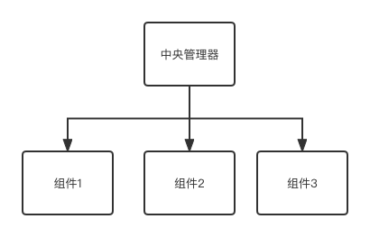
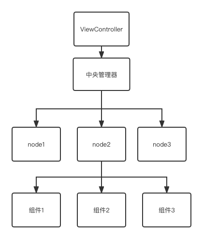

# iOS组件化

组件化是iOS中比较成熟的解耦方式。每个组件是一个相对独立的功能，通常情况下，每个组件每个组件会单独抽成一个独立库，比如UI组件库，网络组件库等。 如果不同库要完全解耦， 对于每个库，需要通过runtime的方式去调用相应服务。

在业务中我们也可以借鉴这种组件化的思想来对业务进行拆分。 

## 为什么需要组件化：

对于一些大型项目来说，随着业务的增长，经常会遇到的一个问题就是"代码爆炸"，一个文件里代码越写越多，甚至到几千行。这会对项目的维护带来很多问题，

1. 大量的逻辑杂合在一个文件里，工程师们很难查找对应功能的逻辑实现并进行修改。

2. 项目中的需求经常是并行的，如果两个需求的逻辑恰好在同一个文件里，代码合并的时候将是一场噩梦。

这时候有人会说了，我用Category去拆分不就好了吗。 Categroy确实能解决代码爆炸的问题，但随之也带来了新的问题。

1. Category声明属性后并不会创建对应的实例变量， 我们只能通过关联对象的方式来实现，对于研发来说是不必要的负担。 
```
objc_setAssociate()
```

2. 对于一些系统回调来说，在Category中无法获取，比如viewWillAppear。当然你可以选择用一些其他方式，比如通知之类的去获取，但实现上显然麻烦不少。  

3. 对于某些可以拆分出来复用的逻辑，采用Category方式显然无法挪到另一个ViewController去使用。这些限制使得Category并不是一个理想的解决方式。


此时我们可以借鉴组件化的思想，将业务逻辑抽成单独的组件。每个ViewController通过组件管理器间接持有这些组件，并将相应的事件发送给各个组件。

## 业务组件如何设计

业务组件是在更小的维度内进行拆分，定位上也不同。相比于不同库之间的组件化方式，业务组件并不需要考虑解耦。更多的是考虑以下几点：

1. 组件如何管理
2. 系统事件的回调
3. 组件间如何相互调用


#### 业务组件的管理和系统事件回调

单纯组件管理其实并不复杂，我们可以直接使用中央管理器的方式对组件进行管理。中央管理器去持有各种组件。 



中央要处理每个ViewController和组件的对应关系,并在ViewController销毁时销毁相关组件。或者更简单的做法是直接每个ViewController创建并持有一个管理器。

对于有哪些组件需要加载，需要有一个配置。大部分情况下，组件的配置在本地通过文件配置写死就够了。但根据业务场景的不同，也可以将配置做成动态下发，根据需要调整配置。


##### 在事件分发上通常采用以下两种方式：

1. 最简单的方式是通过ViewController直接去调用中央管理器对应的方法，直接分发事件，缺点是比较麻烦，需要重复写这些逻辑。

2. 通过swizzle直接去hook对应ViewController的相关方法，然后进行分发。


#### 业务组件间相互调用

因为中央管理器的存在，一个组件只要通过中央管理器是很容易拿到另外一个组件的。但为了避免暴露不必要的信息，引起滥用，我们最好还是对此做一些限制。

我们可以通过协议来实现这个过程。 每个组件都实现了一个与之对应的协议，外部通过协议名去获取对应的组件，获取到的是实现某个协议的id类型对象， 在某个组件中也只可以调用其他组件协议中的方法。 


```

//协议，继承自一个通用协议(用来处理系统回调等)
@protocol protocolA <BasicElementProtocol>

- (void)funtionA;

@end

//实现改协议的组件
@interface ClassA : NSObjct <protocolA>

@end


//获取组件

id<protocolA> eleA = [manager getEleByProtocol:protocolA];

//调用对应方法
[eleA funtionA];

```


这样做基本上可以避免组件之间无限制的相互调用，但不排除有些人会对获取到的对象进行转换，实际上在这种情况下只能取决于研发是否遵循代码规范。因此我们可以更进一步，由中央处理器代为转发方法到对应的组件，调用方无法获取到任何组件。


## 单页面架构的实现

通过组件化的形式，我们可以将所有的逻辑处理都放在不同的组件中，实际上ViewController只负责将各种事件传递给组件。

这种情况下，当我们切换一个场景时，实际上只需要切换所挂载的组件就可以达到同样的目的，也就是单页面架构。

为了方便管理不同的场景，我们需要有一个与之相对应的结构，这里使用节点来表述，每个节点和场景一一对应，并持有该场景下的所有组件。




原本的页面切换现在变成了节点的切换，当然，因为单页面架构的问题， 在场景切换时是不会有viewWillDisappear等回调的。 我们需要自己定义相关的事件，节点的加载，进入，退出等。 一些其他事件也可以去做一个统一的处理，比如用户的登录登出， 前后台切换等，具体可以看业务的需求。

此外还需要考虑以下几点：

1. 不同场景之间的数据传递问题，当从一个场景切换到下一个场景时，我们往往需要传递一些相关参数。

2. 场景切换的策略，当从场景A切换到场景B时， 场景A是否销毁。

3. 组件的复用，场景A和场景B可能存在相同的组件X，当从场景A切换到场景B时，是新创建组件X还是直接复用场景A中的，这需要有对应的策略。

##### 单页面架构有什么好处

单页面架构下，所有场景都是在同一个ViewController内， 这会有以下几个优点：

1. 对于内存的优化
2. 场景切换动画更加简单
3. 可配置性更强

前两点很明显，由于页面架构变简单了，会对内存占用方面有所下降， 另外由于在同一个ViewController内，做动画不需要考虑到ViewController的切换。

在配置性方面，一些应用经常需要分国家城市去下发活动，或是一些本地化的信息。 在普通的MVC或者MVVM架构下，这些配置通常是页面级别的，每个页面需要单独处理，或者通过全局的弹窗，toast之类的展示。

但在单页面架构下，我们可以很轻松地实现全流程的可配置信息位，活动位等。