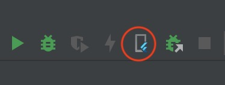

# Flutter入门

本文使用的环境是Xcode + Android studio

## 首先介绍一下几个概念。

### Modules

Flutter模块是Flutter和其他语言进行混编的支持方式。 对于很多项目来说，完全使用Flutter是不现实的，更多情况下只是某几个页面或者模块通过Flutter来实现。这时候我们就需要通过Flutert Module来进行混编。
ss

### Channels

Flutter代码中有时候不可避免地需要调用一些平台原生的API，比如说获取手机电量，打开相册等。这时候我们可以通过Channel来调用原生的objc, swift, java...等实现。


### Packages&Plugins

Package相当于iOS中的SDK。 而Plugin则是一种特殊的Package, 专门用来和原生平台的API进行交互。在一个Plugin中，我们可以实现多个平台的插件代码，而调用Flutter的代码实现是保持一致的。


## 学习路径

因为本身是一个iOS开发，对于混编有较大的需求。
因此对于我来说，首要目标是先弄清楚Flutter开发中的各个环节，项目创建， 混编，Native交互，Debug, 集成，上线等, 因此本篇内容不涉及语言使用方面。

以下是我的学习路径： 

[开发环境配置](https://docs.flutter.dev/get-started/install) :直接根据官方文档操作，非常详细，不再赘述

[Fluter App](#Fluter_App)

[Flutter Channels](#Flutter_Channels)

[Packages&Plugins](#Packages&Plugins)

[Flutter Modules](#Flutter_Modules) 

[iOS工程添加Flutter页面](#iOS工程添加Flutter页面)

[Flutter Attach](#Flutter_Attach)

[Dart语言基础](https://dart.dev/samples): 参考[官方文档](https://dart.dev/samples)


### Flutter App


安装完环境之后我们就可以开始创建我们的第一个Flutter App, 可以用以下两种方式. 因为Flutter是跨平台的，所以在创建时我们需要指定支持的平台和使用的语言。

1 Android Studio  -> File -> New Flutter Project

2 命令行：
```
//默认支持平台 ios , android , windows, linux , macos, web, 使用Swift和Kotlin语言
futter create my_app 

//手动指定支持的平台和语言
flutter create  --platforms  ios  --platforms android -i swift -a kotlin my_app 
 
```


创建完成后，我们可以看到目录底下有这三个文件夹lib, android, ios. 这时候我们可以用三种方式来运行这个工程，Flutter工程，android工程，iOS工程。 其中ios文件夹下Runner.xcworkspace是打开iOS工程的入口。

需要注意的是，直接运行android或者iOS工程的情况下，flutter相关的代码是以gradle或framework集成到工程的，无法直接调试。

lib文件夹下会默认生成一个main.dart文件，其中的main方法是整个程序的入口。文件默认实现了一个demo，直接可以运行。


至于Flutter相关控件这边就不再赘述，可以看以下官方文档，了解常用的UI控件如何使用。[官方文档]()


### <a id="Flutter_Channels"></a> Platform Channels

[官方文档](https://docs.flutter.dev/development/platform-integration/platform-channels?tab=type-mappings-swift-tab)

对于Flutter来说，很多功能需要通过与Native交互来实现.flutter是通过platform channels来实现与Native交互的。 接下来我们来说一下flutter如何与Native交互。

1 flutter侧创建一个platform channel，并通过method channnel调用Nativee

```
//字符串作为标识
static const platform = MethodChannel('samples.flutter.dev/battery');

//通过channel调用方法
final int result = await platform.invokeMethod('getBatteryLevel');

```

2 native侧实现对应的方法

```
let controller : FlutterViewController = window?.rootViewController as! FlutterViewController


let batteryChannel = FlutterMethodChannel(name: "samples.flutter.dev.battery", binaryMessenger: controller.binaryMessenger)

batteryChannel.setMethodCallHandler({(call: FlutterMethodCall, result:  @escaping FlutterResult) -> Void in
    //具体实现内容
})

GeneratedPluginRegistrant.register(with: flutterEngine)
```

或者

```

let controller : FlutterViewController = window?.rootViewController as! FlutterViewController


let batteryChannel = FlutterMethodChannel(name: "samples.flutter.dev.battery", binaryMessenger: controller.binaryMessenger)

let registrar = flutterEngine.registrar(forPlugin: "my_plugin")
       
registrar?.addMethodCallDelegate(self, channel: batteryChannel)
        
GeneratedPluginRegistrant.register(with: flutterEngine)


//实现代理方法

class func register(with registrar: FlutterPluginRegistrar) {
        
}
       
func handle(_ call: FlutterMethodCall, result: @escaping FlutterResult) {
        
    result("iOS systemVersion" + UIDevice.current.systemVersion)
        
}

```


### <a id="Packages&Plugins"></a>Packages&Plugins

Flutter Packages和Plugins没有本质上的差别，Plugins是一种特殊的Packages，是专门用来和Native交互的代码组成的Packages。

#### package

通过以下命名可以创建一个package

```
flutter create --template=package my_module
```

引入一个package的方式比较简单。例如我们要添加url_launcher 5.4.0版本.

1 在pubspec.yaml文件中，添加如下配置。

```
dependencies:               
    url_launcher: ^5.4.0         //包名及版本号
```

如果依赖的库在本地则配置如下

```
dependencies:             
    my_package:
      path: /Users/sugc/my_package    //本地路径

```

2 添加完成后运行命令, 更新依赖。

```
flutter pub get
```

3 使用时在对应的文件中引用相关package，如在main.dart

```
import 'package:characters/characters.dart';
```


#### plugin

通过以下命令创建一个plugin

```
flutter create --org com.example --template=plugin --platforms=android,ios,linux,macos,windows -a java my_plugin
```

plugin中是可以直接编写Native代码的，在创建plugin时我们需要指定平台和对应的语言(语言有默认)。 

在pubspec.yaml有插件的相关配置，指定了支持的平台和对应的实现类

```
 plugin:
    platforms:
      android:  
        package: com.example.my_plugin
        pluginClass: MyPlugin
      ios:  
        pluginClass: MyPlugin
        
```

查看SwiftMyPlugin.swift文件，可以看到默认的注册入口以及方法调用实现。

```
import Flutter
import UIKit

//Native注册插件入口
public class SwiftMyPlugin: NSObject, FlutterPlugin {
  public static func register(with registrar: FlutterPluginRegistrar) {
    let channel = FlutterMethodChannel(name: "my_plugin", binaryMessenger: registrar.messenger())
    let instance = SwiftMyPlugin()
    registrar.addMethodCallDelegate(instance, channel: channel)

  }

//Native方法调用实现
  public func handle(_ call: FlutterMethodCall, result: @escaping FlutterResult) {

    result("iOS" + UIDevice.current.systemVersion)

  }

}
```

my_plugin_method_channel.dart 文件中默认实现了一个插件类MethodChannelMyPlugin。我们可以参照该类实现其他的方法。

```
class MethodChannelMyPlugin extends MyPluginPlatform {
  /// The method channel used to interact with the native platform.
  @visibleForTesting
  final methodChannel = const MethodChannel('my_plugin');

  @override
  Future<String?> getPlatformVersion() async {
    final version = await methodChannel.invokeMethod<String>('getPlatformVersion');
    return version;
  }
}

```


### <a id="Flutter_Modules"></a>Flutter Modules

使用以下代码就能快速创建一个Flutter Module。
创建的flutter module可以通过Android studio打开并进行开发。和flutter app没有什么太大不同。

```
flutter create --template module my_flutter

```

Module整体的目录结构如下

```
my_flutter/
├── .ios/
│   ├── Runner.xcworkspace
│   └── Flutter/podhelper.rb
├── lib/
│   └── main.dart
├── test/
└── pubspec.yaml

```
通过CocoaPods可以很方便地加入到iOS工程中。其他方式可以参考官方文档：[官方文档](https://docs.flutter.dev/development/add-to-app/ios/project-setup)

1 将以下代码加到Podfile中
```
flutter_application_path = '../my_flutter'
load File.join(flutter_application_path, '.ios', 'Flutter', 'podhelper.rb')

```
2 每个需要使用flutter的target中添加以下代码

```
target 'MyApp' do
    install_all_flutter_pods(flutter_application_path)
end

```

3 Podfile中的post_install添加以下代码
```
post_install do |installer|
  flutter_post_install(installer) if defined?(flutter_post_install)
end
```

pod install之后，整个功能就能直接使用flutter了， 如果你的flutter module中引入了其他packages，在pod install之前需要先运行以下命令。

```
flutter pub get
```


### <a id='iOS工程添加Flutter页面'></a> iOS工程添加Flutter页面

将flutter嵌入到iOS工程中后，我们需要将flutter页面展示出来。

1 创建并注册flutter引擎

```
let flutterEngine = FlutterEngine(name:"my flutter engine")
flutterEngine.run()
GeneratedPluginRegistrant.register(with:flutterEngine)

```

2 创建并展示flutter页面

```
let flutterViewController = FlutterViewController(engine: flutterEngine, nibName: nil, bundle: nil)
                
present(flutterViewController, animated: true, completion: nil)
```

### <a id="Flutter_Attach"></a>Flutter Attach

在混编的情况下，我们大部分情况下需要通过XCode去调试相关代码。但XCode是无法直接对flutter代码进行debug的，这时候就需要用到flutter attach的方式了。

使用起来也很方便。

1 在XCode中先运行程序

2 使用Android studio启动对应的flutter工程

3 点击 Flutter Attach 按钮



如果在设备上有多个flutter App运行就会出现如下情况，这时候关闭不需要的App重新Attach，或者选择对应的App进行Attach就行了。

```
There are multiple observatory ports available.
Rerun this command with one of the following passed in as the appId:

  flutter attach --app-id com.sugc.magic.Reflections
  flutter attach --app-id com.sugc.magic.Reflections (2)
  flutter attach --app-id com.example.magicFlutter
  
```


