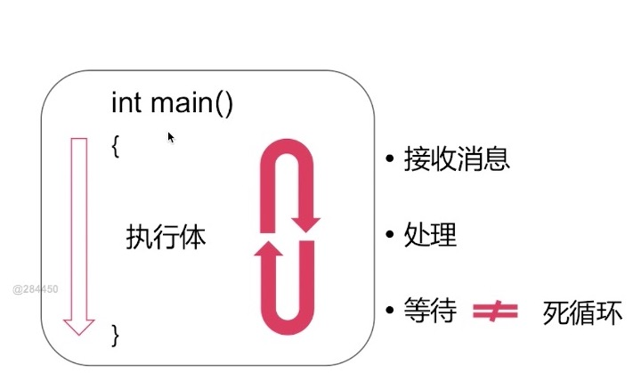
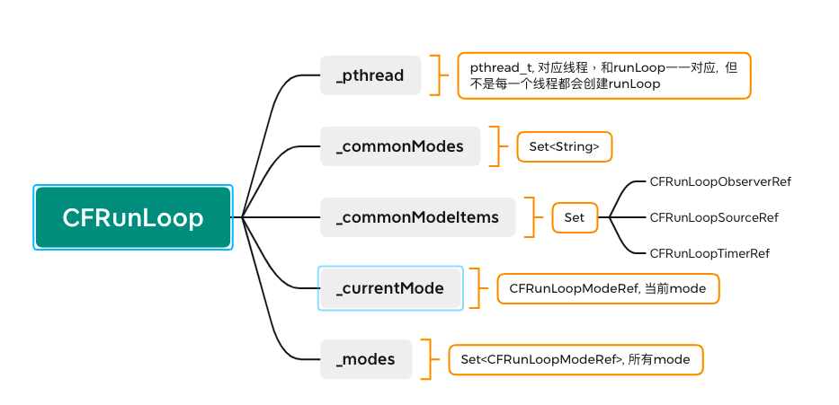
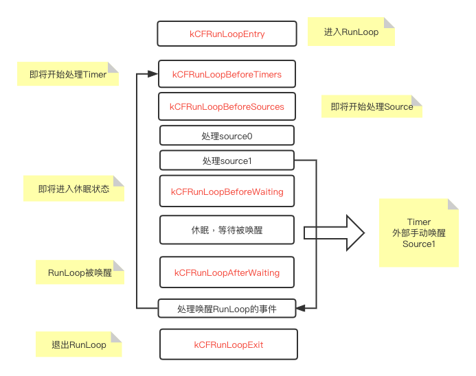

# RunLoop

[源码下载地址](https://opensource.apple.com/tarballs/CF/)

## RunLoop 相关概念

### 什么是RunLoop：
RunLoop是一个通过内部<font color=red>事件循环</font>来管理<font color=red>消息/事件</font>的对象




### 什么是事件循环

通过<font color=red>内核态</font>和<font color=red>用户态</font>的切换来实现：

* 没有消息需要处理的时候休眠以避免资源占用
* 有消息需要处理的时候唤醒处理消息

#### 内核态：
 内核实际上就是我们设备的操作系统，控制着计算机的硬件资源，例如协调CPU资源，分配内存资源，并且提供稳定的环境供应用程序运行。内核必须提供一组通用的访问接口，这些接口就叫系统调用。 当一个任务执行系统调用而陷入内核代码执行中时，我们称之为内核态。

#### 用户态： 
当进程执行自己的用户代码时，此时称之为用户态。 


## RunLoop 数据结构
NSRunLoop是对CFRunLoop的封装.我们可以通过源码[源码下载地址](https://opensource.apple.com/tarballs/CF/)
来查看CFRunLoop的数据结构, 数据结构如下图：


每个RunLoop都对应着一个线程，它和线程是一一对应的，但并不是所有的线程都会创建RunLoop， 只有主线程默认创建RunLoop，其余线程默认是不创建的。我们可以通过以下代码创建RunLoop.
```
CFRunLoopGetCurrent() //获取当前runloop，如果当前线程没有runloop则创建 
```

其中commonModes是个字符串的集合，每个字符串对应一个mode的标识。

每一个mode对应一个commonModeItem, 包含有CFRunLoopObserver, CFRunLoopSource, CFRunLoopTimer. 当我们调用CFRunLoopAddObserver, 实际是往对应的commonModeItem里添加Observer.

## RunLoop生命周期

当我们打开App时， 会调用UIApplicationMain方法启动主线程的RunLoop， 而App被杀死时则会退出主线程的RunLoop. 而在整个App运行期间, 主线程的RunLoop则会维持一个，被唤醒 -> 处理事件 ->休眠 ->被唤醒 的周期循环。 具体如下图：



#### source0和source1：
source1是基于mach_Port的,来自系统内核或者其他进程或线程的事件，具有唤醒RunLoop的能力。 比如屏幕点击，或者网路数据传输。

Source0 ：非基于Port的 处理事件， 也就是说你这个消息不是其他进程或者内核直接发送给你的。一般是APP内部的事件, 比如hitTest:withEvent的处理, performSelectors的事件.


#### 我们可以添加监听器来监听RunLoop的状态：

```
 CFRunLoopObserverRef observer = CFRunLoopObserverCreateWithHandler(CFAllocatorGetDefault(), kCFRunLoopAllActivities, YES, 0, ^(CFRunLoopObserverRef observer, CFRunLoopActivity activity) {
        switch (activity) {
            case kCFRunLoopEntry:
                NSLog(@"即将进入runloop");
                break;
            case kCFRunLoopBeforeTimers:
                NSLog(@"即将处理 Timer");
                break;
            case kCFRunLoopBeforeSources:
                NSLog(@"即将处理 Sources");
                break;
            case kCFRunLoopBeforeWaiting:
                NSLog(@"即将进入休眠");
                break;
            case kCFRunLoopAfterWaiting:
                NSLog(@"从休眠中唤醒loop");
                break;
            case kCFRunLoopExit:
                NSLog(@"即将退出runloop");
                break;
            default:
                break;
        }
    });
        CFRunLoopAddObserver(CFRunLoopGetCurrent(),observer,kCFRunLoopDefaultMode);
```


## RunLoop Mode

RunLoop具有不同的Mode, 当RunLoop在一种模式下运行时，不会处理其他mode下的timer, source和observer. 

系统有以下几个Mode,而实际上公开的只有kCFRunLoopDefaultMode和UITrackingRunLoopMode.

```
kCFRunLoopDefaultMode: App的默认 Mode，通常主线程是在这个 Mode 下运行的。
UITrackingRunLoopMode: 界面跟踪 Mode，用于 ScrollView 追踪触摸滑动，保证界面滑动时不受其他 Mode 影响。
UIInitializationRunLoopMode: 在刚启动 App 时第进入的第一个 Mode，启动完成后就不再使用。
GSEventReceiveRunLoopMode:接受系统事件的内部 Mode，通常用不到。
```

#### kCFRunLoopCommonModes
kCFRunLoopCommonModes 不是一个实际存在的mode, 实际上是几个mode的集合，它是一种将source, timer, observer同步到不同mode的一种技术方案。

例: 同时添加Timer到kCFRunLoopDefaultMode和UITrackingRunLoopMode下。
```
[[NSRunLoop currentRunLoop] addTimer:timer forMode:NSRunLoopCommonModes];
```

## RunLoop 应用


### 常驻线程

正常情况下，一个子线程在执行完任务之后就会退出， 但我们可以通过RunLoop来实现一个常驻线程。

实现如下：

```
//1 创建对应线程
 NSThread *thread = [[NSThread alloc] initWithTarget:self selector:@selector(threadMain) object:nil];
 [thread start];

//2 在对应线程创建RunLoop
- (void)threadMain {
    NSRunLoop *loop = [NSRunLoop currentRunLoop];
    
//3 创建并添加port

    NSRunLoop *loop = [NSRunLoop currentRunLoop];
    NSPort *port = [[NSPort alloc] init];
    [loop addPort:port forMode:NSDefaultRunLoopMode];
    
//4 启动RunLoop
    [loop run];
}

```


### 实现网络请求等不打断UI操作
当用户在操作时，比如滑动Tableview, 此时如果有网络数据返回，进行刷新，无疑会打断用户的操作，造成不好的体验。 而如果要判断此时用户的操作状态去决定是否刷新，又无疑是一件高成本的事。此时我们就可以通过在指定mode下执行任务来实现。

滑动TableView时，主线程的RunLoop会切换到UITrackingRunLoopMode下, 此时我们可以只在NSDefaultRunLoopMode下执行任务，就不会打断操作。
```
  [[NSRunLoop mainRunLoop] performInModes:@[NSDefaultRunLoopMode] block:^{
        
    }];
```


